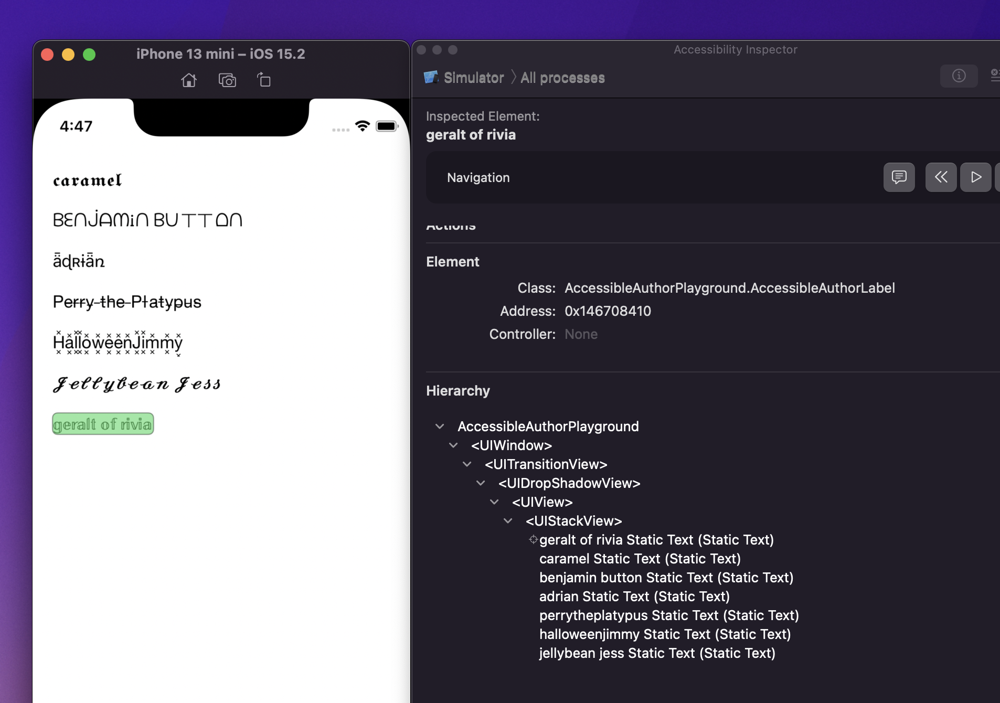

# AccessibleAuthorLabel 🔖

Takes those cursed usernames you see on social networks and lets them be accessible to screen readers so everyone can partake in Twitter equally!

(This is a quick, less than one hour fun little project that I'm sure is flawed. In a perfect world folks would stop using those kind of characters so text would be easily accessible to all, but since people are stubborn this seemed like a fun way to try to try to bake it into screen readers themselves sort of.)

The project basically relies on a simple lookup table, generated from the [Lingojam TwitterFonts website](https://lingojam.com/TwitterFonts) but reverses it to map them back to their "normal" counterparts. Many of the characters seldom have use outside of decorative text, so something like semantic markup designating it as an author label rather than a math formula could perhaps allow screen readers to do the heavy lifting for users. I'm sure my lookup table is currently missing entries, and some are hard to map, but hey, don't let perfect be the enemy of good!

Inspired by [a fun convo](https://twitter.com/ChristianSelig/status/1473373617652183042) on Twitter

# Usage

Just change instances of `UILabel` where you want this to operate to `AccessibleAuthorLabel` and include `AccessibleAuthorLabel.swift` and `mapping.plist` into your project.

If you do truly want to use this, there's probably some optimizations worth making around reading in plists files on each label read, as well as string mapping, but again, proof of concept!

